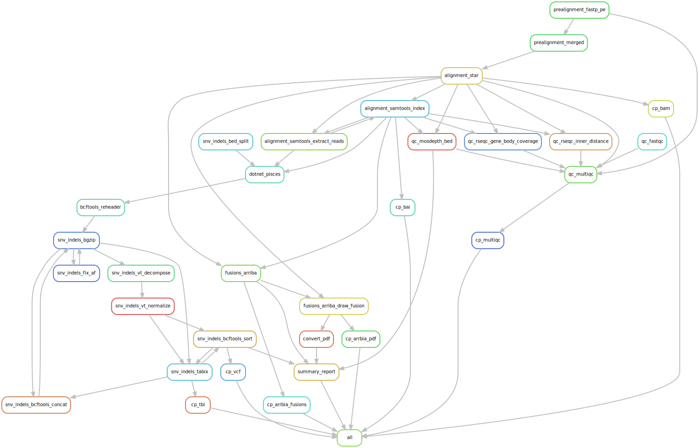

# :snake: BCR-ABL1 pipeline for RNA data


[](https://opensource.org/licenses/gpl-3.0.html)

## :speech_balloon: Introduction
[comment]: <> (Something about nextera?)
This pipeline is to find variants in the BCR-ABL1 transcript. It also identifies which fusions are detected in the data with [Arriba](https://github.com/suhrig/arriba) as an extra qc step. It is based on [Hydra-Genetics](https://github.com/hydra-genetics) modules with local adaptiations. It process `.fastq`-files and procduces a summerized report in `.xlsx`-format, a `.bam`-file, a `.vcf.gz`-file, as well as Arriba results for each sample. QC values for the batch can be found in the MultiQC report. For variant calling [Illumina Pisces](https://github.com/Illumina/Pisces) v5.2.11 is used.

The following [Hydra-genetics](https://github.com/hydra-genetics) modules are used:
- [prealignment](https://github.com/hydra-genetics/prealignment)
- [alignment](https://github.com/hydra-genetics/alignment)
- [snv_indels](https://github.com/hydra-genetics/snv_indels)
- [fusions](https://github.com/hydra-genetics/fusions)
- [qc](https://github.com/hydra-genetics/qc)
- [misc](https://github.com/hydra-genetics/misc)

## :heavy_exclamation_mark: Dependencies

In order to use this module, the following dependencies are required:

[](https://github.com/hydra-genetics/)
[](https://pandas.pydata.org/)
[
[](https://snakemake.readthedocs.io/en/stable/)
[](https://sylabs.io/docs/)

## :school_satchel: Preparations

### Sample data

Input data should be added to [`samples.tsv`](https://github.com/clinical-genomics-uppsala/bcr_abl_pipeline/blob/develop/config/samples.tsv)
and [`units.tsv`](https://github.com/clinical-genomics-uppsala/bcr_abl_pipeline/blob/develop/config/units.tsv).
The following information need to be added to these files:

| Column Id | Description |
| --- | --- |
| **`samples.tsv`** |
| sample | unique sample/patient id, one per row |
| tumor_conten | tumor content in sample, float |
| **`units.tsv`** |
| sample | same sample/patient id as in `samples.tsv` |
| type | data type identifier (one letter), **R**NA |
| platform | type of sequencing platform, e.g. `MiSeq` |
| machine | specific machine id, e.g. NovaSeq instruments have `@M0xxxx` |
| flowcell | identifer of flowcell used (MiSeq flowcells with 000000 fails, remove the zeros)|
| lane | flowcell lane number |
| barcode | sequence library barcode/index, connect forward and reverse indices by `+`, e.g. `ATGC+ATGC` |
| fastq1/2 | absolute path to forward and reverse reads |
| adapter | adapter sequences to be trimmed, separated by comma |

### Reference data
Reference files should be specified in [`config.yaml`](https://github.com/clinical-genomics-uppsala/bcr_abl_pipeline/blob/develop/config/config.yaml)
- `.fasta` reference file
-  `.gtf`  reference file
- A design file,`.bed` over entire genes
- List of positions of interesets (e.g. Branford list) in bedformat
- Arriba specific files:
    -  Blacklist
    -  `.gff3` protein domains
    -  known fusions list
    -  Cytobands
 - rseq bedfile
 - `SampleSheet.csv` for sorting samples in MultiQC report

### Containers
All containers but two are available [online](https://github.com/clinical-genomics-uppsala/bcr_abl_pipeline/blob/develop/config/config.yaml). For the `.xlsx`-report a python3 enviorment with the `pysam`, `xlsxwriter` and `gzip` packages are needed. For variantcalling a container with [Illumina Pisces](https://github.com/Illumina/Pisces) v5.2.11 is needed.

## :white_check_mark: Testing

The workflow repository contains a small test dataset `.tests/integration` which can be run like so:

```bash
$ cd .tests/integration
$ snakemake -n -s ../../workflow/Snakefile -j1 --use-singularity --configfile config.yaml
```

## :rocket: Usage

To run the workflow [`resources.yaml`](https://github.com/clinical-genomics-uppsala/bcr_abl_pipeline/blob/develop/config/resources.yaml) is needed together with a [snakmake profile](https://github.com/clinical-genomics-uppsala/bcr_abl_pipeline/blob/develop/snakemake_profile/config.yaml). If used on the CGU compute cluster the `start_bcr_abl1_pipeline.sh` can be used.

### Output files

The following output files should be targeted via another rule:

| File | Description |
|---|---|
| `Results/MultiQC_R.html` | Summerized QC values in [MultiQC](https://multiqc.info/) report |
| `Results/${sample}_R_summary.xlsx` | Xlsx report with Branford list, coverage and arriba results summerized |
| `Results/${sample}_R/${sample}_R.bam(.bai)` | Alignment file from [STAR aligner](https://github.com/alexdobin/STAR) with index |
| `Results/${sample}_R/${sample}_R.normalized.sorted.vcf.gz(.tbi)` | Variant file produced by [Illumina Pisces](https://github.com/Illumina/Pisces) variant caller with index|
| `Results/${sample}_R/${sample}_R.arriba.fusions.tsv` | Fusions reported from the [Arriba](https://github.com/suhrig/arriba) fusion caller |
| `Results/${sample}_R/${sample}_R.arriba.pdf` | PDF illustrations of fusions reported from the Arriba |


## :judge: Rule Graph

