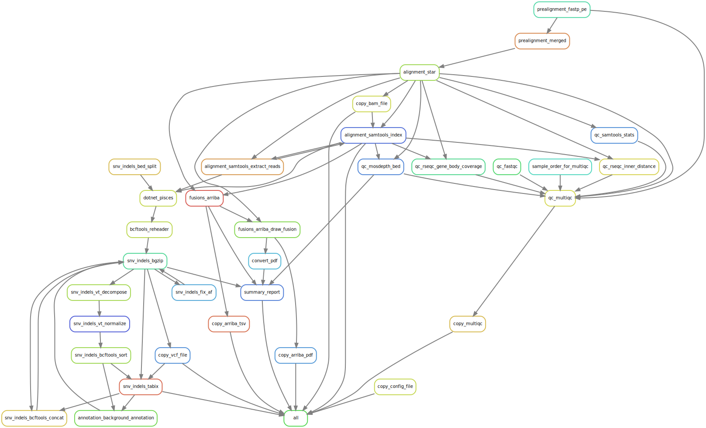

# :snake: Pickett: BCR-ABL1 pipeline for RNA data


[](https://opensource.org/licenses/gpl-3.0.html)

## :speech_balloon: Introduction
[comment]: <> (Something about nextera?)
This pipeline is to find variants in the BCR-ABL1 transcript. It also identifies which fusions are detected in the data with [Arriba](https://github.com/suhrig/arriba) as an extra QC step. It is based on [Hydra-Genetics](https://github.com/hydra-genetics) modules with local adaptations. It process `.fastq`-files and produces a summarized report in `.xlsx`-format, a `.bam`-file, a `.vcf.gz`-file, as well as Arriba results for each sample. QC values for the batch can be found in the MultiQC report. For variant calling [Illumina Pisces](https://github.com/Illumina/Pisces) v5.2.11 is used.

The following [Hydra-genetics](https://github.com/hydra-genetics) modules are used:
- [annotation](https://github.com/hydra-genetics/annotation)
- [alignment](https://github.com/hydra-genetics/alignment)
- [fusions](https://github.com/hydra-genetics/fusions)
- [prealignment](https://github.com/hydra-genetics/prealignment)
- [snv_indels](https://github.com/hydra-genetics/snv_indels)
- [qc](https://github.com/hydra-genetics/qc)

For exact versions/tag of each module see [`workflow/Snakefile`](workflow/Snakefile).

## :heavy_exclamation_mark: Dependencies

In order to use this module, the following dependencies are required:

[](https://github.com/hydra-genetics/)
[](https://pandas.pydata.org/)
[]
[](https://snakemake.readthedocs.io/en/stable/)
[](https://sylabs.io/docs/)

## :school_satchel: Preparations

### Sample data

Input data should be added to [`samples.tsv`](https://github.com/clinical-genomics-uppsala/pickett_bcr_abl_pipeline/blob/master/config/samples.tsv)
and [`units.tsv`](https://github.com/clinical-genomics-uppsala/pickett_bcr_abl_pipeline/blob/masters/config/units.tsv).
The following information need to be added to these files:

| Column Id | Description |
| --- | --- |
| **`samples.tsv`** |
| sample | unique sample/patient id, one per row |
| **`units.tsv`** |
| sample | same sample/patient id as in `samples.tsv` |
| type | data type identifier (one letter), **R**NA |
| platform | type of sequencing platform, e.g. `MiSeq` |
| machine | specific machine id, e.g. NovaSeq instruments have `@M0xxxx` |
| flowcell | identifier of flowcell used (MiSeq flowcells with 000000 fails, remove the zeros)|
| lane | flowcell lane number |
| barcode | sequence library barcode/index, connect forward and reverse indices by `+`, e.g. `ATGC+ATGC` |
| fastq1/2 | absolute path to forward and reverse reads |
| adapter | adapter sequences to be trimmed, separated by comma |

### Reference data
Reference files should be specified in [`config.yaml`](config/config.yaml)
- `.fasta` reference file
-  `.gtf`  reference file
- A design file,`.bed` over entire genes
- List of positions of interests (e.g. Branford list) in bedformat
- Arriba specific files:
    -  Blacklist
    -  `.gff3` protein domains
    -  known fusions list
    -  Cytobands
 - rseq bedfile
 - Background-file to annotate calls with (see more [below](#backgroundreference-pipeline))

### Containers
All containers but one are available on [Dockerhub](https://github.com/clinical-genomics-uppsala/pickett_bcr_abl_pipeline/blob/master/config/config.yaml). For variantcalling a container with [Illumina Pisces](https://github.com/Illumina/Pisces) v5.2.11 is needed.

## :white_check_mark: Testing

To do a dry-run test, `.tests/integration` can be used:

```bash
$> cd .tests/integration
$> snakemake -n -s ../../workflow/Snakefile --configfiles ../../config/config.yaml config.yaml --config PATH_TO_REPO=/path/to/repo/
```
> **_NOTE:_**   If using the variable `PATH_TO_REPO` (folder containing `pickett_bcr_abl_pipeline`) in the config-file this need to be defined in the commandline

## :rocket: Usage

To run the workflow [`resources.yaml`](https://github.com/clinical-genomics-uppsala/pickett_bcr_abl_pipeline/blob/master/config/resources.yaml) is needed together with a [snakemake profile](https://github.com/clinical-genomics-uppsala/pickett_bcr_abl_pipeline/blob/master/snakemake_profile/config.yaml). 

```bash
$> snakemake --profile path_to_snakemake_profile/ -s workflow/Snakefile --configfile config.yaml --config PAH_TO_REPO=/path/to/repo
```
> **_NOTE:_**  If using the variable `PATH_TO_REPO` in the config-file this need to be defined in the commandline
    
### Output files

The following output files will be saved (remaining files are deleted after completed run):

| File | Description |
|---|---|
| `Results/MultiQC_R.html` | Summarized QC values in [MultiQC](https://multiqc.info/) report |
| `Results/${sample}_R_summary.xlsx` | Xlsx report with Branford list, coverage and Arriba results summarized |
| `Results/${sample}_R/${sample}_R.bam(.bai)` | Alignment file from [STAR aligner](https://github.com/alexdobin/STAR) with index |
| `Results/${sample}_R/${sample}_R.normalized.sorted.background_annotated.vcf.gz(.tbi)` | Variant file produced by [Illumina Pisces](https://github.com/Illumina/Pisces) variant caller with index |
| `Results/${sample}_R/${sample}_R.arriba.fusions.tsv` | Fusions reported from the [Arriba](https://github.com/suhrig/arriba) fusion caller |
| `Results/${sample}_R/${sample}_R.arriba.pdf` | PDF illustrations of fusions reported from the Arriba |


## :judge: Rule Graph


---


# Background/Reference pipeline
To create the needed background file a number of gVCFs are needed that are then used by a modified version of the hydra-genetics [reference module](https://github.com/hydra-genetics/references). For best results the gVCF-samples should be spread out over several runs and machines (if applicable) to minimize batch effects and machine differences. Therefore a separate but almost identical pipeline is set up to be used. Since the Reference module is adapted to gVCFs created by Mutect2 and Pickett uses Illumina Pisces variant caller the `create_background.py` needed to be adapted to work.

## :speech_balloon: Introduction
The background script uses all positions in all gVCFs that are not soft-filtered (see vcf for exact filters), below the min_dp parameter (default 500X) or over max_af (default 0.005). Then for all positions with at least 4 observations a median allelic frequency and standard deviation are included.

## :school_satchel: Preparations

### Sample data
Since the background pipeline uses the standard Pickett pipeline the same sample preparations are needed. A `samples.tsv` and an `units.tsv` file with samples to include in background calculations

### Reference files
The only unique variables needed are a specific output filelist, [`output_files_background.yaml`](config/output_files_background.yaml), this is included in [`config_background.yaml`](config/config_background.yaml).

## :rocket: Usage
To run the background pipeline you simply use the `Snakefile_background.smk` and list both the standard configfile as well as the background configfile.
```bash
$> snakemake --profile path_to_snakemake_profile/ -s workflow/Snakefile_background.smk --configfiles config/config.yaml config/config_background.yaml
```

> **_NOTE:_**   If using the variable `PATH_TO_REPO` in the config this need to be defined in the commandline

### Output files
| File | Description |
|---|---|
| `Results/${sample}_R/${sample}_R.vcf.gz(.tbi)` | Genome variant file per sample produced by [Illumina Pisces](https://github.com/Illumina/Pisces) variant caller with index |
| `Results/background_panel.tsv` | tsv-file with the columns [chr, pos, median, sd, num samples]|

## :judge: Rule Graph
